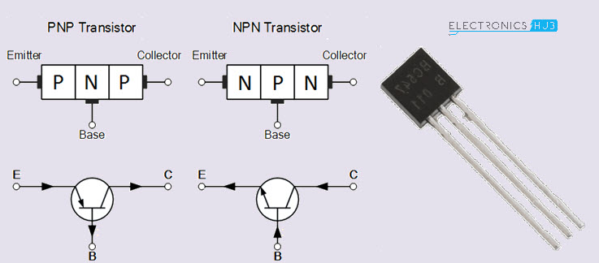

# Logic Gates

**0** -> OFF -> False -> 0 Volts 
**1** -> ON -> True -> 5 volts (something over than 0)

**NPN** : *Negative-Positive-Negative* 
**PNP**: *Positive-Negative-Positive*

**Transistor**: *device that is used to control or regulate the flow of electronic signals.* 

Parts of the transistor: 
&emsp;&emsp; - **Emitter**: *the transistor's negative lead.* 
&emsp;&emsp; - **Base**: the terminal that activates the transistor. 
&emsp;&emsp; - **Collector**: *the transistor's positive lead.*

### **Buffer Gates**:

*Strengthens a signal without changing its logic value.  
(E.G. if it receives a logic 1, it outputs a logic 1, and if receives a logic 0, it outputs a logic 0)*

 

### **Not Gates**:

**Ā** = *Complementary of A*

*Not gate is also called a negator, because it "negates" the input. 
(E.G. if it receives a logic 1, it outputs a logic 0, and if it receives a logic 0, it outputs a logic 1)*

