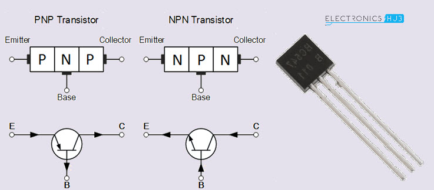
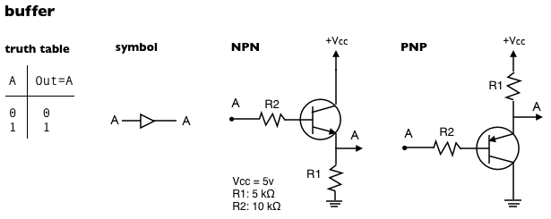
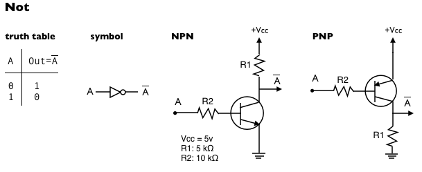
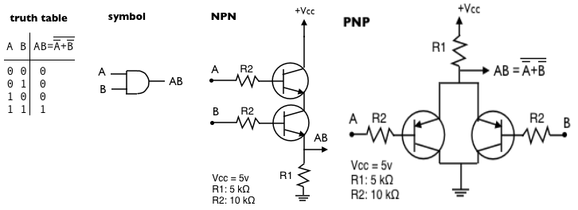
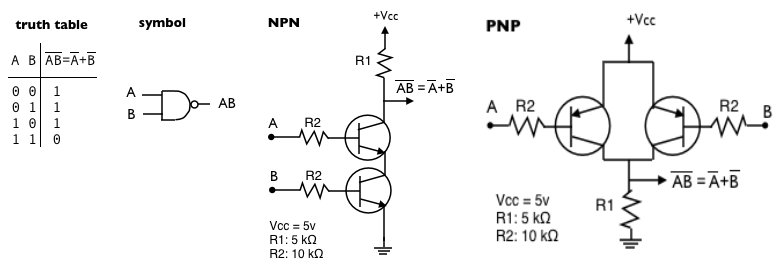
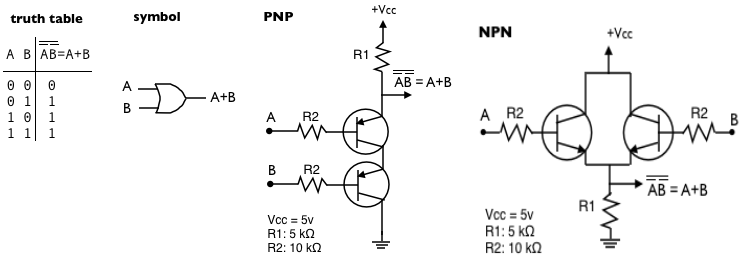
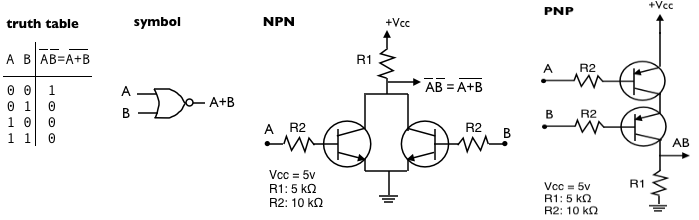
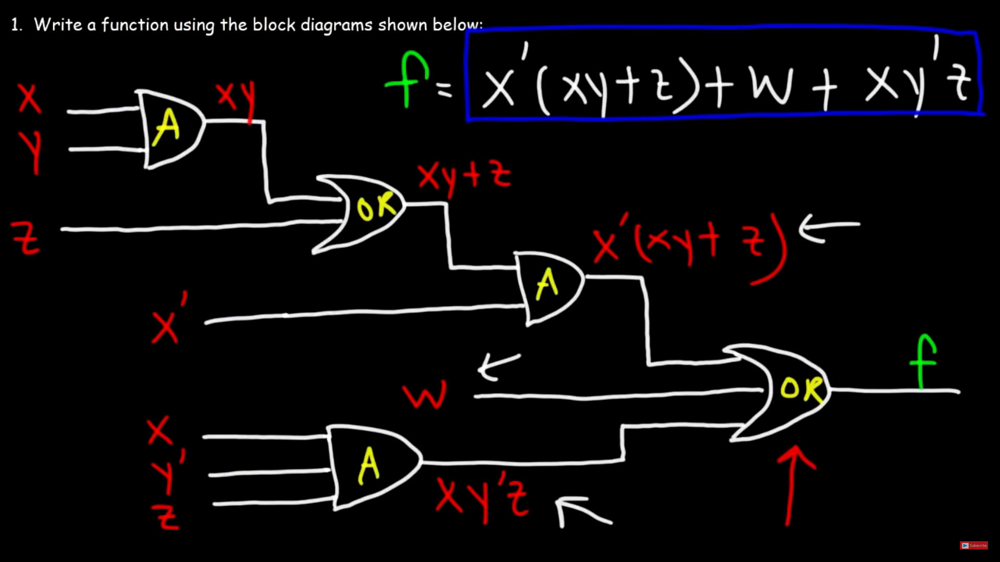
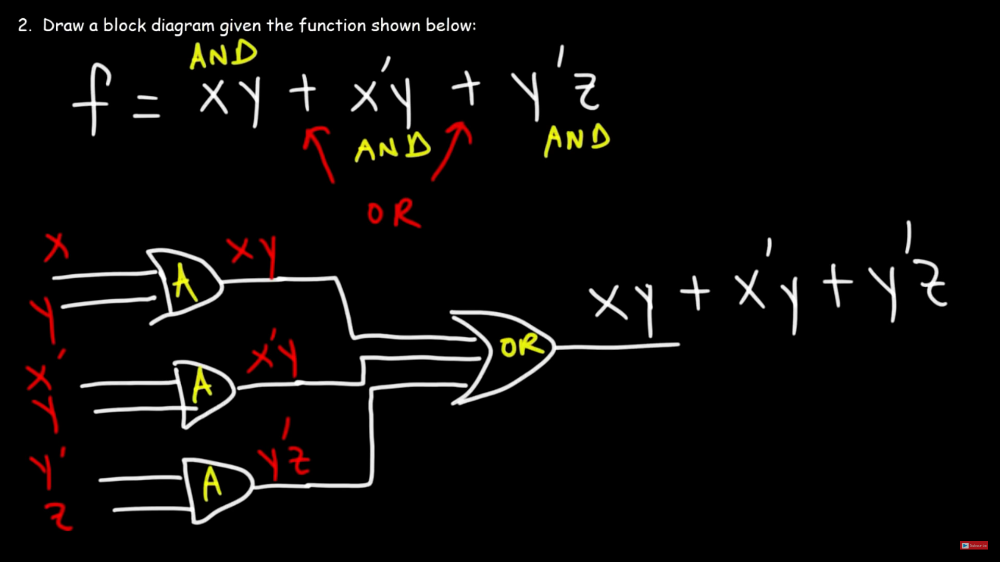
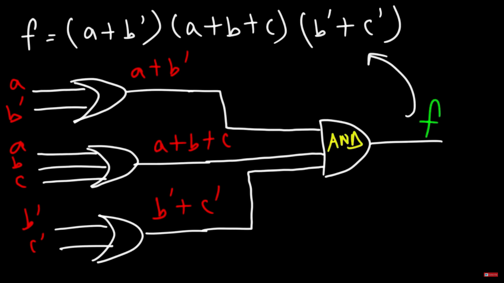

# Logic Gates

**0** -> OFF -> False -> 0 Volts
 
**1** -> ON -> True -> 5 volts (something over than 0)

 

**Transistor**: *device that is used to control or regulate the flow of electronic signals.* 

Parts of the transistor
 
&emsp;&emsp; **Emitter** -> *the transistor's negative lead.*
 
&emsp;&emsp; **Base** -> the terminal that activates the transistor.
 
&emsp;&emsp; **Collector** -> *the transistor's positive lead.* 

&emsp;&emsp; **NPN** -> *Negative-Positive-Negative* 
&emsp;&emsp; **PNP** -> *Positive-Negative-Positive*

 
 
 

### **BUFFER Gates**:

*Strengthens a signal without changing its logic value.  
(E.G. if it receives a logic 1, it outputs a logic 1, and if receives a logic 0, it outputs a logic 0)*

 

### **NOT Gates**:

**Ā** = *Complementary of A*

*Not gate is also called a negator, because it "negates" the input.
 
If it receives a logic 1, it outputs a logic 0, and if it receives a logic 0, it outputs a logic 1*

### **AND Gate**:

*We can get an AND gate using two NPN transistors connected in series in a common collector configuration.*

### **NAND Gate**:

*NAND is the complementary of AND.*
 
*The combination of an AND gate and a NOT gate --> NAND gate*

### **OR Gate**:

*The OR gate outputs "true" if any of its inputs are "true", otherwise it outputs "false".*

### **NOR Gate**:

*NOR is the complementary of OR.*
 
*The combination of an OR gate and a NOT gate --> NOR gate*

 
<b>- <ins>FUNCTION EXAMPLES</b></ins>
 
 

**AND GATE** = *multiplication*
 
**OR GATE** = *addition*

*SOP -> sum of products expression*

*POS -> product of sums expression*
