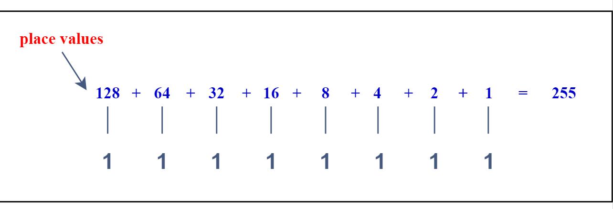

go watch this https://youtu.be/RrJXLdv1i74?si=uOPiFgpP3Gzd4A1v

### **What is a Binary number?**
Represent a quantitive value between 0 and 1
 
 

### **How to count in Binary?**

&emsp; 1) increase right most column by 1
 
&emsp; 2) when you run out of digits -> reset column that ran out to 0
 
&emsp; 3) increase next column by 1
  

### **How is a Binary Number made?**

**1 byte** -> *8 bits* *(each bit is a digit)*
 
**Minimum Value** -> 0
 
**Maximum Value** -> 255
 
**Overflow** -> *a catching situation when we go beyond the Maxmum Value*
 
**Cardinality** = *size of the array (base^bits = Maximum Combinations)*
 
*1 byte has 256 different configurations which means it can store up to 256 different numbers.*
 
*Each bit till the 8th gets doubled.*

