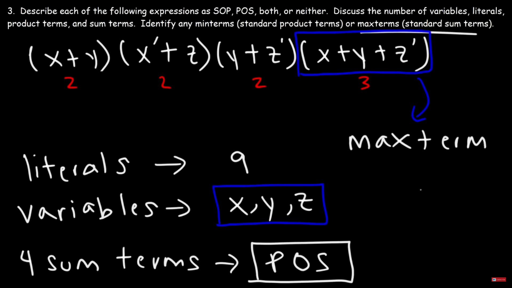

# Boolean Albegra
*L'Algebra Booleana è utilizzata per analizzare e sintetizzare i Logic Gates*.
 

**AND GATE** = *multiplication*
 
**OR GATE** = *addition*

 

 

**SOP** -> *sum of products expression*

 

**POS** -> *product of sums expression*

 

---

**Minterms** -> standard product terms
 
**Maxterms** -> standard sum terms
 
**Variables** -> which are the different variable used
 
**Literals** -> total number of literals
 
*They are taken when one expression has all variables in it.*

 

